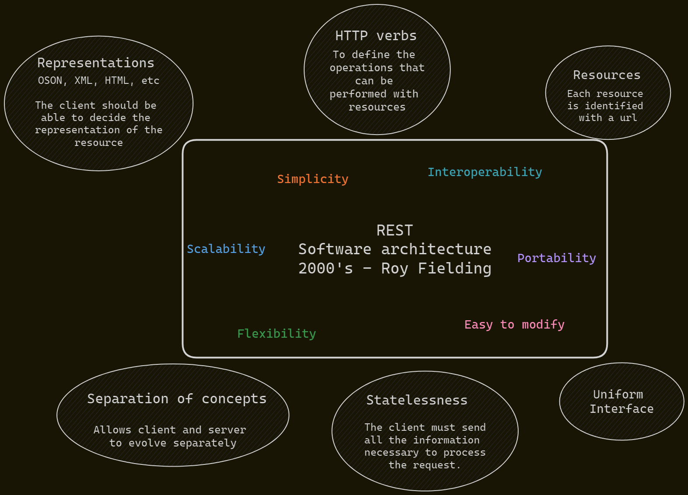

# API

API trying to follow REST software architecture.



The most of methods and their url are path-to-regexp compatible that is used by Express.

This API is not a REST API, it is a REST-like API.

The following code breaks the concept of immutability of the REST architecture:

```javascript
movies.push(newMovie)
```

## Idempotent

Idempotent means that the result of a request is always the same, no matter how many times it is executed.

### Idempotent methods

#### POST

Create a new element/resource.

`/movies`

It is not idempotent because it creates a new resource every time it is executed.

#### PUT

Update an existing element/resource.

`/movies/1`

It is idempotent because it updates the same resource every time it is executed, then the result is always the same.

#### PATCH

Partially update an existing element/resource.

`/movies/1`

Normally it is idempotent, but it depends on the implementation.

For example, if the request is to add a updateAt field, then it is not idempotent.

## CORS

Normal methods: GET/HEAD/POST
Complex methods: PUT/PATCH/DELETE

CORS pre-flight: Complex methods requires a special request called OPTIONS.

```javascript
app.options('/movies/:id', (req, res) => {
  const ORIGIN = req.header('origin')
  if (ALLOWED_ORIGINS.includes(ORIGIN) || !ORIGIN) {
    res.header('Access-Control-Allow-Origin', ORIGIN)
    res.header('Access-Control-Allow-Methods', 'GET, POST, PUT, PATCH, DELETE')
  }
  res.send(204)
})
```
