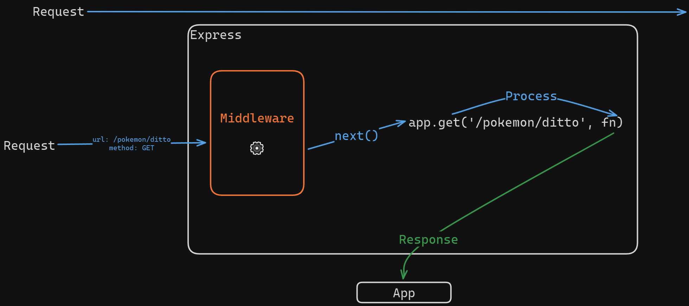

# Express

Migration of the [http](../http/index.js) server to Express framework.

## Middlewares



Custom middleware was created to read json from request body.

```js
const app = require('express')()
app.use((req, res, next) => {
  if (
    req.method !== 'POST' ||
    req.headers['content-type'] !== 'application/json'
  ) {
    return next()
  }

  let data = ''

  req.on('data', chunk => {
    data += chunk.toString()
  })

  req.on('end', () => {
    req.body = data
    next()
  })
})

```
