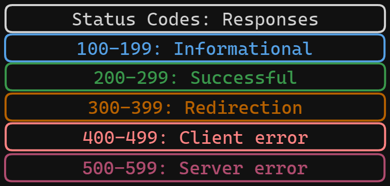
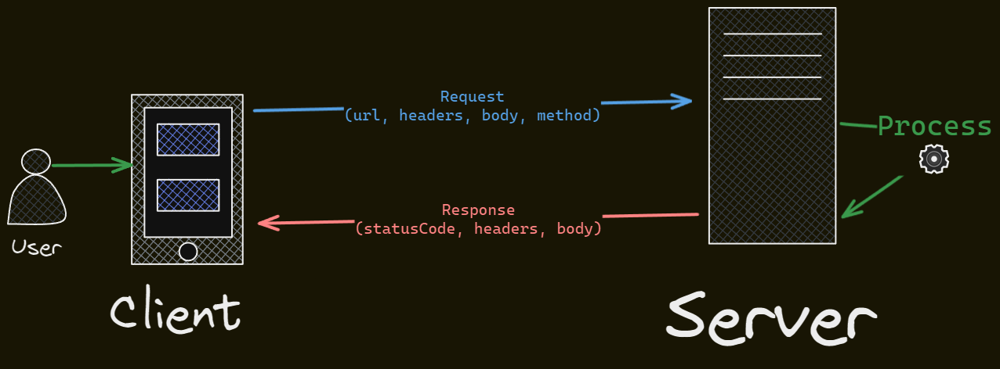

# HTTP without Express

Simple HTTP server and client using http module.

## Status codes and responses

## Client <-> Server

## Testing

To test the api use [REST CLIENT](api.http) extension.

| Method | Path           | Description       |
| ------ | -------------- | ----------------- |
| GET    | /pokemon/ditto | Get ditto pokemon |
| POST   | /pokemon       | Create a pokemon  |
