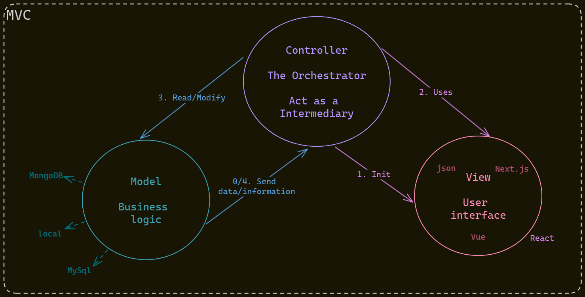

# MVC

MVC is a design pattern used to decouple user-interface (view), data (model), and application logic (controller). This pattern helps to achieve separation of concerns.

Using the MVC pattern for websites, requests are routed to a Controller that is responsible for working with the Model to perform actions and/or retrieve data. The Controller chooses the View to display and provides it with the Model. The View renders the final page, based on the data in the Model.

> From [ASP.NET MVC Pattern](https://dotnet.microsoft.com/en-us/apps/aspnet/mvc#:~:text=Model%20View%20Controller%20(MVC),and%20application%20logic%20(controller).)

## Screaming Architecture

The Screaming Architecture is a concept that was introduced by Robert C. Martin in his book Clean Architecture: A Craftsman's Guide to Software Structure and Design. The Screaming Architecture is a way of organizing the code so that it screams the intent of the software. It is a way of organizing the code so that it is obvious what the software is doing and how it is doing it.
