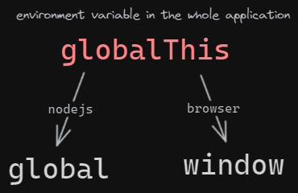
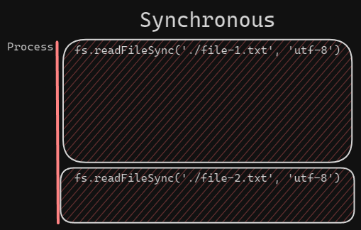

# Nodejs



## Use case for the most used nodejs modules

Such as:

- [ls.js](ls.js) - list files in a directory
- [os.js](os.js) - get information about the operating system
- [path.js](path.js) - get information about the path
- [process.js](process.js) - get information about the process

## Nodejs System modules

CommonJS are the classic way to import modules in nodejs.

```javascript
const fs = require('fs')
module.exports = fs
```

ESModules are modern and **recommended** way to import modules in nodejs.

```javascript
import fs from 'fs'
export default fs
```

The file extension when importing modules is important. **Always add the file extension**.

| File Extensions | Description             |
| --------------- | ----------------------- |
| .js             | by default use CommonJS |
| .mjs            | use ES6 (ES Modules)    |
| .cjs            | use CommonJS            |

**It is bad practice not to add the file extension every time it is being imported.**

You don't need to change the file extensions to .mjs again and again, just add `"type": "module"` in the package.json file.

```json
{
  "type": "module"
}
```

## Asynchronous programming

A Asynchronous programming could look like this:



> If a module doesn't have a /promises folder, you can use the promisify function

Instead, every application should be asynchronous. This means that the application should not wait for a response from a function, but should continue to execute the code. The function will then call a callback function when it is finished.

### callbacks

[fs-callback-async.js](fs-callback-async.js)


### Sequential execution

[fs-sequential-async.js](fs-sequential-async.js)


### Parallel execution

[fs-parallel-async.js](fs-parallel-async.js)


